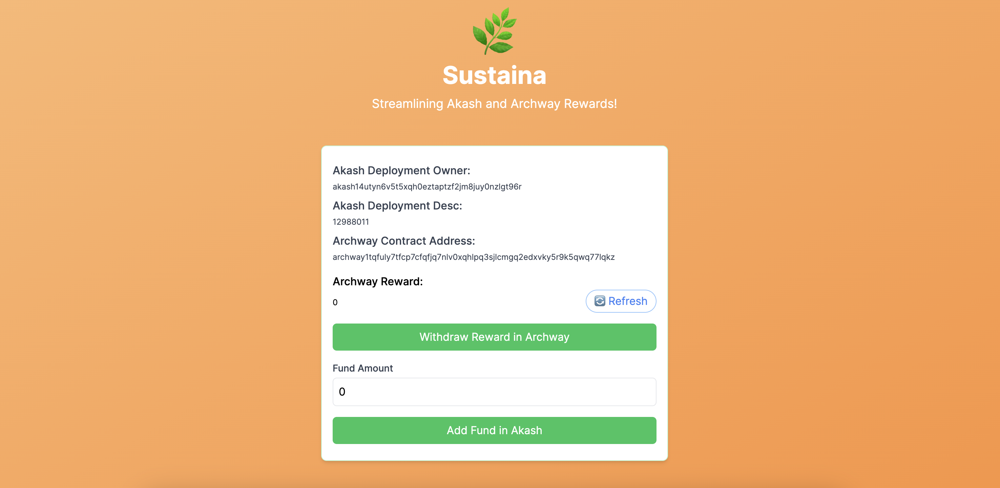
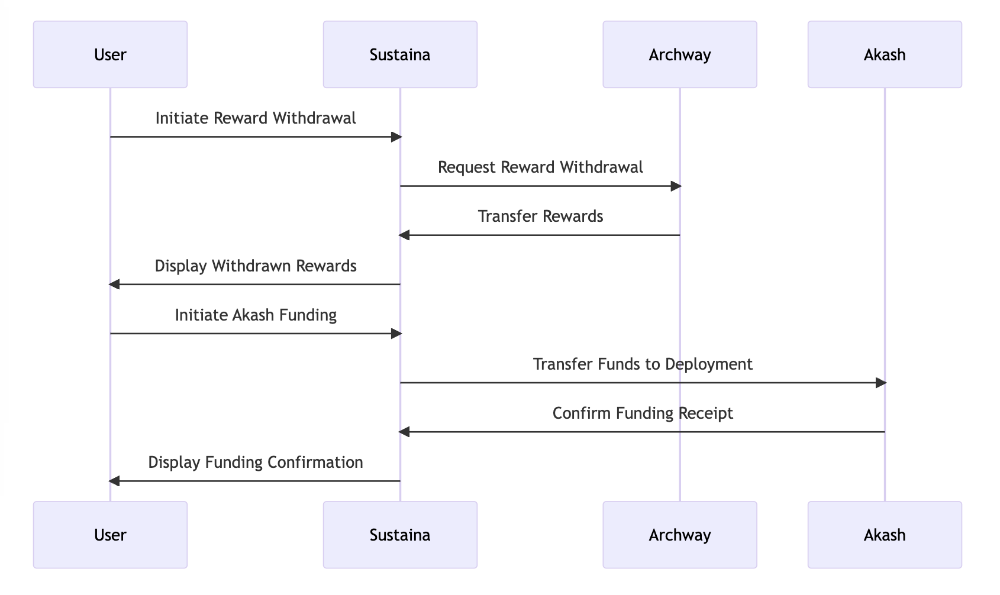

# Sustaina

Streamlining Akash and Archway Rewards!

## Description

Sustaina is an application designed to streamline the management of funds for Akash deployment by integrating the Archway contract reward withdrawal function. Users can conveniently withdraw Archway rewards and add funds to Akash deployment, addressing the high costs associated with managing Akash deployments independently.

## Problem

Managing funds to keep Akash deployment can be cumbersome and costly for the user.

## Solution

Sustaina addresses this problem by integrating Archway reward withdrawal functionality with Akash deployment funding. Users can set Archway reward withdrawal transactions to Akash deployment funding transaction memos for enhanced transparency. This reduces the managerial burden and extra costs associated with maintaining Akash deployments using Archway rewards, especially when the app is utilized by a multitude of users.

## Technical Detail

- **Archway Reward Withdrawal:** Allows users to withdraw rewards from Archway contracts seamlessly.
- **Akash Deployment Funding:** Enables users to add funds directly to Akash deployments.
- **Transaction Memo Setting:** Users can link Archway reward withdrawal transactions to Akash deployment funding transaction memos for transparency.
- **User-friendly Interface:** Provides an easy-to-use platform for users to manage their funds and deployments.

Note: Currently, a bridge between Archway and Akash is necessary to use Osmosis separately, as an official bridge incorporating swap functionality between Archway and Akash has not been established yet.

## How to Use

TBD
