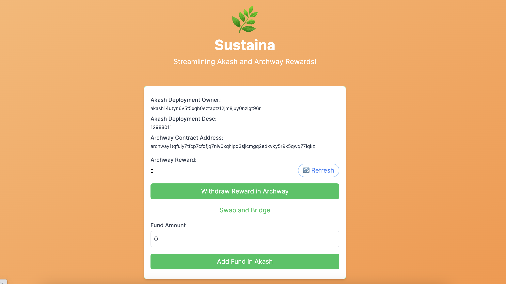

# Sustaina

Streamlining Akash Deployment and Archway Rewards!



## Live App

http://df634uh841dcn2vg94d2ks15oc.ingress.provider02.nebulablock.com/

### Akash Deployment

https://deploy.cloudmos.io/deployment/akash14utyn6v5t5xqh0eztaptzf2jm8juy0nzlgt96r/12988011?network=mainnet

## Demo Video

https://youtu.be/G_fKpgI9-jM

## Pitch Deck

https://docs.google.com/presentation/d/1pvsUnwMZZ51K_1EB2fd7O814TFRlzQ9qM2Y2ikyf83M/edit?usp=sharing

## Docker Image for Demo App

https://hub.docker.com/layers/ookimaki/nextjs-akash-5/0.0.2/images/sha256-306f398dbf546d81b04be116d38df76c64b994df0d9dda20bcada44e5faff2d6?context=explore

## Archway Test Contract Address

https://www.mintscan.io/archway/wasm/contract/archway1tqfuly7tfcp7cfqfjq7nlv0xqhlpq3sjlcmgq2edxvky5r9k5qwq77lqkz

## Description

Sustaina is an application designed to streamline the management of funds for Akash deployment by integrating the Archway contract reward withdrawal function. Users can conveniently withdraw Archway rewards and add funds to Akash deployment, addressing the high costs associated with managing Akash deployments independently.

## Problem

Managing funds to keep Akash deployment can be cumbersome and costly for the user.

## Solution

Sustaina addresses this problem by integrating Archway reward withdrawal functionality with Akash deployment funding. Users can set Archway reward withdrawal transactions to Akash deployment funding transaction memos for enhanced transparency.

## Technical Detail

- **Archway Reward Withdrawal:** Allows users to withdraw rewards from Archway contracts seamlessly.
- **Akash Deployment Funding:** Enables users to add funds directly to Akash deployments.
- **Transaction Memo Setting:** Users can link Archway reward withdrawal transactions to Akash deployment funding transaction memos for transparency.


Note: Currently, a bridge between Archway and Akash is necessary to use Osmosis separately, as an official bridge incorporating swap functionality between Archway and Akash has not been established yet.

## How to Use

### Prerequisites

Before you start, ensure to:

- Create your Akash deployment
- Set up an Archway contract

**Note:** The Akash deployment owner and the Archway contract reward address must be identical to use this app.

### Steps

#### **1. Go to Dashboard**

- Access live app on Akash, please check the top of readme for the url.
- Input the `Akash deployment owner` and `akashDeploymentDesc`, along with the `archwayContractAddress`.
- Click **Go to Dashboard**.

#### **2. Withdraw Reward**

- Click **Refresh** to update and view the current reward amount on Archway.
- Click **Withdraw Reward** in Archway to proceed.

#### **3. Convert and Bridge on Osmosis**

- Navigate to Osmosis and follow the on-screen instructions for conversion and bridging operations.

#### **4. Add Fund in Akash**

- Determine your desired funding amount.
- Click **Add Fund** in Akash to finalize the process.

### Deploy Own App

```
git clone https://github.com/taijusanagi/sustaina
cd app
docker buildx build --platform linux/amd64 -t <username>/<image> . // this is command for my Mac M2
docker push <username>/<image>
```

Then replace <username><image> at this deployment.yml, then try Akash deployment.

https://github.com/taijusanagi/sustaina/blob/main/app/deployment.yml
